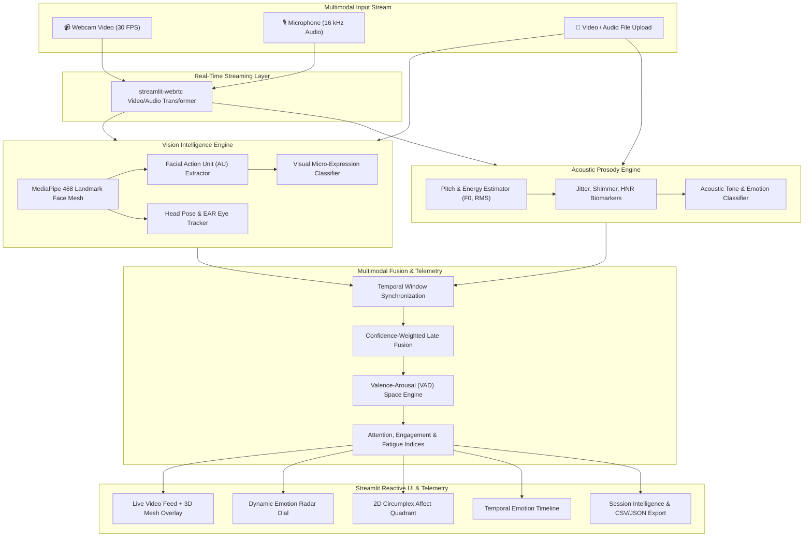

# 🎭🧠 EmotionSense

<div align="center">

[](https://www.python.org/)
[](https://streamlit.io/)
[](https://developers.google.com/mediapipe)
[](https://opencv.org/)
[](https://plotly.com/)
[](LICENSE)

**Enterprise Real-Time Multimodal Emotion Recognition, Conversational Dialogue Trajectory & Affective Telemetry Intelligence Platform**

[Features](#-key-features) • [Text Studio](#-text--conversational-affect-studio) • [Architecture](#-architecture--data-flow) • [Quickstart](#-quickstart--installation) • [Testing](#-running-tests)

</div>

---

## 📌 Overview

**EmotionSense** is an enterprise-grade affective artificial intelligence platform designed to decode human emotion across all primary communication modalities: **Text & Conversational Dialogue**, **Visual Micro-Expressions (3D Face Mesh)**, and **Acoustic Voice Prosody (Pitch & Tone)**.

Whether analyzing single text messages, multi-turn chat transcripts, customer support tickets, live camera feeds, or uploaded media files, EmotionSense maps emotional states into continuous **3D Valence-Arousal-Dominance (VAD)** spaces with token-level explainability, conversational trajectory tracking, and empathy response recommendations.

---

## 🚀 Key Features

### 💬 Text & Conversational Affect Intelligence (Single, Dialogue & Batch)
- **Instant Single Message Emotion Decoder**: Immediate classification across 8 Ekman emotions (*Joy, Sadness, Anger, Fear, Surprise, Disgust, Neutral, Contempt*) + extended nuances (*Love, Excitement, Optimism, Anxiety, Frustration, Gratitude, Confusion, Empathy*).
- **100+ Emoji & Emoticon Affect Mapping**: Decodes emotional intensity, sentiment valence, and arousal boosts from modern emojis.
- **Negation & Modifier Engine**: Context-aware sentiment inversion (*"not happy" ➔ Sadness/Neutral*) and intensifier scaling (*"extremely", "super", "barely"*).
- **Token-Level Salience & Explainability**: Interactive visual highlight badges showing exactly which words triggered each emotion.
- **Multi-Turn Chat Transcript Parser**: Ingests WhatsApp, iMessage, Slack, and Zendesk chat transcripts with automatic speaker segmentation.
- **Conversational Trajectory & Escalation Watchdog**: Turn-by-turn line charts tracking mood shifts, emotional conflict escalation risk (*Low, Moderate, High, Critical*), and turning points.
- **Empathy & Rapport Synchrony**: Quantifies affective alignment and emotional mirroring between participants.
- **AI Empathy Auto-Reply Templates**: Recommends context-aware communication responses (De-escalation, Supportive Validation, Celebratory Affirmation).
- **Batch Dataset & CSV Stream**: Ingests bulk text datasets with instant Donut distributions, tabular inspection, and 1-click CSV/JSON exports.

### 👁️ Computer Vision & 3D Facial Micro-Expressions
- **468-Point 3D Face Mesh**: Sub-millimeter landmark tracking via Google MediaPipe.
- **Facial Action Unit (AU) Decoding**: Computes dynamic Action Units (AU1 Inner Brow, AU4 Brow Lowerer, AU12 Lip Smile, AU15 Lip Depressor, AU26 Jaw Drop).
- **Head Pose & Fatigue Rate**: Real-time pitch, yaw, roll estimation and blink/fatigue analysis.

### 🎙️ Acoustic Prosody & Vocal Tone Analysis
- **Fundamental Frequency (F0 / Pitch)**: Tracks pitch contour, mean pitch, and dynamic range.
- **Energy & Quality Biomarkers**: RMS intensity, frequency perturbation (Jitter), and amplitude micro-variability (Shimmer).

### ⚡ Tri-Modal Fusion Engine
- **Confidence-Weighted Late Fusion**: Dynamically synchronizes Vision, Audio, and Text signals with adaptive modality weights ($w_v, w_a, w_t$).
- **Russell's 2D/3D VAD Circumplex**: Continuous projection into Valence, Arousal, and Dominance coordinates.
- **Behavioral Telemetry**: Computes Attention Score (0–100%), Engagement Index (0–100%), and Fatigue Level (0–100%).

### 🛡️ Affective Anomaly Sentinel & Clinical Diagnostic Exporter
- **Real-Time Distress Sentinel**: Evaluates sudden emotional valence crashes ($\Delta V \le -0.45$), hyper-arousal stress spikes, sustained distress, and cognitive fatigue overload.
- **Severity-Graded Alerting**: Automatically classifies anomalies into `INFO`, `WARNING`, and `CRITICAL` tiers with context-aware mitigation recommendations.
- **Standalone Diagnostic HTML & Markdown Reports**: 1-click export of executive telemetry summaries, emotion distributions, anomaly event logs, and pivot moments.
- **🏥 Publication-Grade Clinical PDF Dossiers**: Generates multi-page printable PDF clinical evaluation records via ReportLab with metadata headers, VAD coordinate tables, and clinician audit sign-off blocks.

### 👥 Multi-Speaker Affect & Dyadic Social Dynamics (Phase 5)
- **Multi-Face Centroid Tracking**: Simultaneously tracks up to 4 distinct faces with Euclidean centroid distance matching, bounding box IoU association, persistent subject IDs (`P0`, `P1`, etc.), and disappearance grace periods.
- **Acoustic Speaker Diarization**: Energy-based Voice Activity Detection (VAD) coupled with spectral centroid, rolloff, zero-crossing rate, and 13 MFCC feature embeddings clustered via K-Means to identify speaker turns and speaking durations.
- **Dyadic Conversational Dynamics**: Quantifies talk-time dominance ratios, conversational balance entropy ($H_{\text{balance}} = - \sum p_i \log_2 p_i$), and speech overlap interruption frequency.
- **Interpersonal Synchrony & Mimicry**: Computes Pearson cross-correlation of emotional valence trajectories, cross-lagged smile mimicry (0.5s–2.5s window), and attention reciprocity.
- **Composite Dyadic Rapport Index (0–100)**: Multi-factor clinical rapport scoring combining valence synchrony, arousal concordance, conversational balance, dynamic mimicry, mutual gaze attentiveness, and turn-taking fluency.
- **Clinical Dyadic PDF Dossier**: Comprehensive multi-speaker assessment records with participant profiles, dominance donuts, synchrony metrics, and clinician audit blocks.

### 💾 Structured SQLite Persistence & Session Intelligence
- **High-Performance Embedded Database**: SQLite in WAL mode with indexing on timestamps, assessment categories, and dominant affects.
- **Enterprise Clinical Metadata**: Tracks Candidate / Subject ID, Name, Evaluator, Assessment Type (*Clinical Screening, Talent Interview, Wellness Tracking, Academic Research*), clinical notes, and tags.
- **Cascading Relational Schemas**: Relational mapping across `sessions`, `session_metadata`, `session_samples`, and `session_anomalies`.
- **Idempotent Legacy Migration**: 1-click and automated synchronization of legacy flat-file JSON sessions into the relational database.


### 🎛️ Precision Neuro-Affective Instrument UI & Design System
- **Authentic Domain Aesthetic**: Replaces generic AI tropes (purple gradients, bloated glassmorphism blur) with a high-precision laboratory instrument interface.
- **Technical Canvas & Contrast**: Deep obsidian charcoal base (`#0b0e14`) with a calibrated structural grid (`28px`), tactile console cards, and WCAG AAA contrast ratios.
- **Dual-Font Typography Hierarchy**: `Plus Jakarta Sans` for authoritative display typography paired with `JetBrains Mono` for tabular telemetry figures, timestamps, and FACS codes.
- **Calibrated Emotion Palette**: Emotion categories are semantically mapped to affective psychological models (Plutchik / Russell) for immediate, unambiguous diagnostic clarity.
- **Dynamic Circumplex Vector Trails**: Real-time 2D Russell Circumplex with historical trajectory fading trails tracking emotional momentum.


---

## 🏗️ Architecture & Data Flow



---

## 🛠️ Technology Stack

| Domain | Technology | Description |
| :--- | :--- | :--- |
| **Framework & UI** | [Streamlit](https://streamlit.io/) | Reactive web framework with custom dark glassmorphism styling |
| **Streaming & I/O** | [streamlit-webrtc](https://github.com/whitphx/streamlit-webrtc) / [PyAV](https://github.com/PyAV-Org/PyAV) | Low-latency WebRTC video and audio frame transformation |
| **Computer Vision** | [Google MediaPipe](https://developers.google.com/mediapipe) / [OpenCV](https://opencv.org/) | 468-point 3D face mesh, landmark geometry, and video rendering |
| **Acoustic Analysis** | [Librosa](https://librosa.org/) / [SciPy](https://scipy.org/) / [SoundFile](https://python-soundfile.readthedocs.io/) | Audio DSP, pitch extraction (pyin/yin), jitter, shimmer, spectrograms |
| **Telemetry & Visuals** | [Plotly](https://plotly.com/python/) | Interactive WebGL-accelerated radar dials, affect quadrants, timelines |
| **Data & Core Math** | [NumPy](https://numpy.org/) / [Pandas](https://pandas.pydata.org/) | High-speed array vectorization and session data frames |
| **Testing & Quality** | [Pytest](https://docs.pytest.org/) | Automated test suite for vision, audio DSP, and fusion engines |

---

## 📁 Project Structure

```text
EmotionSense/
├── .gitignore                    # Git ignore configuration
├── requirements.txt              # Production dependencies
├── README.md                     # Comprehensive project documentation
├── memory.md                     # Codebase intelligence & architecture memory
├── config.py                     # Global app settings, palette tokens & constants
├── app.py                        # Main Streamlit application entry point & navigation
│
├── src/
│   ├── __init__.py
│   ├── core/
│   │   ├── __init__.py
│   │   ├── config.py             # Model thresholds, fusion weights & categories
│   │   └── types.py              # EmotionData, AffectVector, Dyadic metrics dataclasses
│   │
│   ├── vision/
│   │   ├── __init__.py
│   │   ├── face_mesh.py          # 468-point MediaPipe face mesh & multi-face extraction
│   │   ├── emotion_classifier.py # Action unit geometric classifier & head pose
│   │   └── multi_face_tracker.py # Centroid & IoU multi-subject tracking engine
│   │
│   ├── audio/
│   │   ├── __init__.py
│   │   ├── prosody.py            # Pitch (F0), RMS energy, jitter, shimmer DSP
│   │   ├── voice_sentiment.py    # Acoustic sentiment & vocal emotion classifier
│   │   └── diarizer.py           # Acoustic speaker diarization & turn-taking
│   │
│   ├── fusion/
│   │   ├── __init__.py
│   │   ├── multimodal_fusion.py  # Temporal sliding window late fusion engine
│   │   ├── metrics.py            # Attention, Engagement, and Fatigue metrics
│   │   ├── anomaly_detector.py   # Affective anomaly & distress sentinel engine
│   │   └── interaction_dynamics.py# Dyadic synchrony, mimicry & rapport index analyzer
│   │
│   ├── media/
│   │   ├── __init__.py
│   │   ├── demuxer.py            # Audiovisual PyAV container demuxer & sync timeline
│   │   └── speech_transcriber.py # Live microphone speech-to-text & phonetic affect engine
│   │
│   ├── storage/
│   │   ├── __init__.py
│   │   ├── database.py           # Thread-safe SQLite engine with WAL mode
│   │   └── models.py             # SQLAlchemy models & schema definitions
│   │
│   ├── ui/
│   │   ├── __init__.py
│   │   ├── styles.py             # Dark glassmorphism CSS injection
│   │   ├── charts.py             # Dyadic synchrony, dominance, radar & circumplex charts
│   │   ├── components.py         # Dyadic summary cards, score gauges, and HUD cards
│   │   └── video_processor.py    # Multi-face WebRTC Video & Audio Stream Transformers
│   │
│   ├── utils/
│   │   ├── __init__.py
│   │   ├── logger.py             # Structured application logging
│   │   ├── session_manager.py    # Session state recording, analytics & export
│   │   ├── report_generator.py   # Diagnostic HTML/Markdown clinical report generator
│   │   └── pdf_exporter.py       # Publication-grade clinical PDF generator (ReportLab)
│   │
│   └── pages/
│       ├── 1_💬_Text_Studio.py     # Single message, multi-turn chat & batch analysis
│       ├── 2_🎥_Live_Studio.py     # Real-time multimodal streaming studio (Multi-Face support)
│       ├── 3_📁_File_Analysis.py   # Pre-recorded video/audio & Dyadic interaction analyzer
│       ├── 4_📑_Session_History.py # History viewer, timeline scrubbing & reports
│       └── 5_📐_Architecture.py    # System architecture & documentation viewer
│
└── tests/
    ├── __init__.py
    ├── test_vision.py            # Vision pipeline & geometric unit tests
    ├── test_audio.py             # Acoustic DSP & prosody extractor unit tests
    ├── test_fusion.py            # Multimodal fusion & metric calculation tests
    ├── test_anomaly_detector.py  # Affective anomaly & sentinel unit tests
    ├── test_report_generator.py  # Clinical diagnostic report generator tests
    ├── test_text_emotion.py      # Text emotion & salience NLP tests
    ├── test_api_server.py        # FastAPI endpoints & WebSocket stream tests
    ├── test_transformer_hybrid.py# Transformer fallback & hybrid classifier tests
    ├── test_demuxer.py           # Audiovisual container demuxer & synchronization tests
    ├── test_speech_transcriber.py# Speech transcription & phonetic buffer tests
    ├── test_webrtc_stream.py     # Concurrent WebRTC audio/video processor stream tests
    ├── test_multi_face_tracker.py# Multi-face centroid & IoU tracking unit tests
    ├── test_diarizer.py          # Acoustic speaker diarization & turn segmentation tests
    ├── test_interaction_dynamics.py# Dyadic synchrony, mimicry & rapport index tests
    ├── test_ui_dyadic_charts.py  # Dyadic UI telemetry charts & dominance donut tests
    ├── test_storage.py           # SQLite database persistence & migration tests
    └── test_pdf_exporter.py      # Clinical PDF dossier generation tests
```

---

## 🏁 Quickstart & Installation

### Prerequisites
- Python 3.10 or higher
- Webcam and microphone (for real-time streaming features)
- Modern web browser with WebRTC support (Chrome, Firefox, Edge, Safari)

### 1. Clone the Repository
```bash
git clone https://github.com/AadityaBhuree/EmotionSense.git
cd EmotionSense
```

### 2. Create and Activate a Virtual Environment
```bash
# Windows
python -m venv venv
venv\Scripts\activate

# macOS / Linux
python3 -m venv venv
source venv/bin/activate
```

### 3. Install Dependencies
```bash
pip install -r requirements.txt
```

### 4. Launch EmotionSense Studio
```bash
streamlit run app.py
```
*The interactive dashboard will open automatically at `http://localhost:8501`.*

### 5. Launch FastAPI Microservice (Optional)
```bash
uvicorn server:app --host 0.0.0.0 --port 8000 --reload
```
*Interactive Swagger OpenAPI documentation is available at `http://localhost:8000/docs`.*

---

## 🐳 Docker Deployment

Run both the Streamlit Studio and the FastAPI Microservice in containerized isolation:

```bash
# Build and run containers in background
docker compose up -d

# View live application logs
docker compose logs -f
```

---

## 🧪 Running Tests & Quality Verification

Validate the full multimodal vision, audio DSP, acoustic diarization, dyadic interaction, NLP, SQLite persistence, and FastAPI microservice pipelines using `pytest` and `ruff`:

```bash
# Execute automated test suite (105 tests)
pytest -v

# Run code hygiene and lint validation
ruff check .
```
*All 105 unit, integration, persistence, and dyadic telemetry tests run with 100% pass rate across Python 3.10+.*

---

## 🔌 API Reference & Endpoints

| Method | Endpoint | Description |
|---|---|---|
| `GET` | `/health` | Service health status & active neural mode |
| `POST` | `/api/predict/text` | Single message 8-Ekman + 3D VAD + Token Salience |
| `POST` | `/api/analyze/dialogue` | Multi-turn transcript parser with escalation & synchrony |
| `POST` | `/api/analyze/dyadic` | Dyadic interaction dynamics, valence/arousal cross-correlation & rapport index |
| `POST` | `/api/audio/diarize` | Acoustic speaker diarization, turn segmentation & conversational balance |
| `POST` | `/api/batch/predict` | Batch text list affective classification & distributions |
| `POST` | `/api/anomalies/detect` | Evaluates timeline frames for sudden valence crashes & fatigue overload |
| `POST` | `/api/reports/generate` | Generates standalone clinical diagnostic reports (HTML & Markdown) |
| `GET` | `/api/sessions` | Query saved sessions with filters (`assessment_type`, `tag`, `search`) & pagination |
| `GET` | `/api/sessions/{id}` | Retrieve complete session record with timeline samples |
| `POST` | `/api/sessions` | Persist or update session record in SQLite database |
| `PATCH` | `/api/sessions/{id}/metadata` | Update subject details, assessment category, notes, and tags |
| `DELETE` | `/api/sessions/{id}` | Delete session and cascading samples from database |
| `POST` | `/api/sessions/migrate` | Import legacy flat JSON sessions into SQLite |
| `GET` | `/api/stats` | Platform-wide metrics, session counts, and assessment distributions |
| `WS` | `/ws/stream-affect` | Real-time bidirectional WebSocket typing affect stream |
| `WS` | `/ws/stream-speech` | Bidirectional WebSocket stream for live speech transcription & phonetic affect |

### Real-Time WebSocket Streaming Client CLI

```bash
# Live affect telemetry from text
python scripts/ws_stream_client.py --endpoint affect --text "We just shipped Phase 3 with full test coverage!"

# Live speech transcription & phonetic prosody alignment from audio
python scripts/ws_stream_client.py --endpoint speech --simulate-audio --pitch 220
```

---

## 🎯 Use Cases

- **HR & Interview Intelligence**: Evaluate candidate confidence, genuine smiles, stress markers, and emotional stability during interviews.
- **Mental Wellness & Healthcare**: Non-invasive tracking of longitudinal affective patterns, depressive vocal markers, and fatigue.
- **Customer Experience & Sales**: Real-time feedback on customer engagement and sentiment during discovery calls.
- **EdTech & Remote Learning**: Measure student attention span, confusion, and cognitive fatigue in live webinars.


---

## 📄 License

This project is licensed under the [MIT License](LICENSE) — see the LICENSE file for details.

---

## 👤 Author

**Aditya Bhure**  
GitHub: [@AadityaBhuree](https://github.com/AadityaBhuree)
