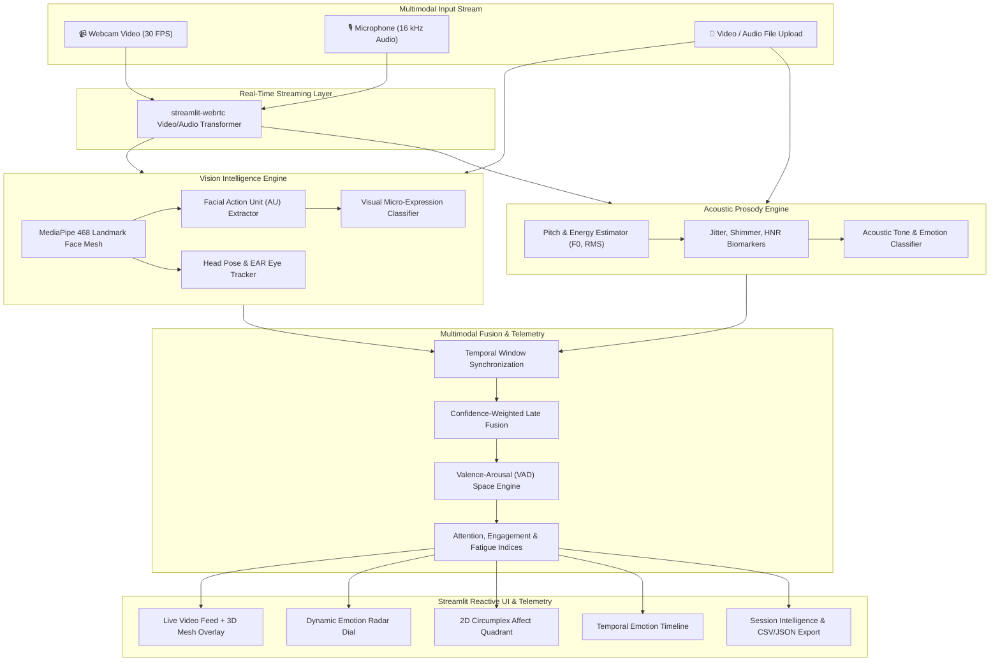

# 🎭🧠 EmotionSense

<div align="center">

[](https://www.python.org/)
[](https://streamlit.io/)
[](https://developers.google.com/mediapipe)
[](https://opencv.org/)
[](https://plotly.com/)
[](LICENSE)

**Enterprise Real-Time Multimodal Emotion Recognition, Conversational Dialogue Trajectory & Affective Telemetry Intelligence Platform**

[Features](#-key-features) • [Text Studio](#-text--conversational-affect-studio) • [Architecture](#-architecture--data-flow) • [Quickstart](#-quickstart--installation) • [Testing](#-running-tests)

</div>

---

## 📌 Overview

**EmotionSense** is an enterprise-grade affective artificial intelligence platform designed to decode human emotion across all primary communication modalities: **Text & Conversational Dialogue**, **Visual Micro-Expressions (3D Face Mesh)**, and **Acoustic Voice Prosody (Pitch & Tone)**.

Whether analyzing single text messages, multi-turn chat transcripts, customer support tickets, live camera feeds, or uploaded media files, EmotionSense maps emotional states into continuous **3D Valence-Arousal-Dominance (VAD)** spaces with token-level explainability, conversational trajectory tracking, and empathy response recommendations.

---

## 🚀 Key Features

### 💬 Text & Conversational Affect Intelligence (Single, Dialogue & Batch)
- **Instant Single Message Emotion Decoder**: Immediate classification across 8 Ekman emotions (*Joy, Sadness, Anger, Fear, Surprise, Disgust, Neutral, Contempt*) + extended nuances (*Love, Excitement, Optimism, Anxiety, Frustration, Gratitude, Confusion, Empathy*).
- **100+ Emoji & Emoticon Affect Mapping**: Decodes emotional intensity, sentiment valence, and arousal boosts from modern emojis.
- **Negation & Modifier Engine**: Context-aware sentiment inversion (*"not happy" ➔ Sadness/Neutral*) and intensifier scaling (*"extremely", "super", "barely"*).
- **Token-Level Salience & Explainability**: Interactive visual highlight badges showing exactly which words triggered each emotion.
- **Multi-Turn Chat Transcript Parser**: Ingests WhatsApp, iMessage, Slack, and Zendesk chat transcripts with automatic speaker segmentation.
- **Conversational Trajectory & Escalation Watchdog**: Turn-by-turn line charts tracking mood shifts, emotional conflict escalation risk (*Low, Moderate, High, Critical*), and turning points.
- **Empathy & Rapport Synchrony**: Quantifies affective alignment and emotional mirroring between participants.
- **AI Empathy Auto-Reply Templates**: Recommends context-aware communication responses (De-escalation, Supportive Validation, Celebratory Affirmation).
- **Batch Dataset & CSV Stream**: Ingests bulk text datasets with instant Donut distributions, tabular inspection, and 1-click CSV/JSON exports.

### 👁️ Computer Vision & 3D Facial Micro-Expressions
- **468-Point 3D Face Mesh**: Sub-millimeter landmark tracking via Google MediaPipe.
- **Facial Action Unit (AU) Decoding**: Computes dynamic Action Units (AU1 Inner Brow, AU4 Brow Lowerer, AU12 Lip Smile, AU15 Lip Depressor, AU26 Jaw Drop).
- **Head Pose & Fatigue Rate**: Real-time pitch, yaw, roll estimation and blink/fatigue analysis.

### 🎙️ Acoustic Prosody & Vocal Tone Analysis
- **Fundamental Frequency (F0 / Pitch)**: Tracks pitch contour, mean pitch, and dynamic range.
- **Energy & Quality Biomarkers**: RMS intensity, frequency perturbation (Jitter), and amplitude micro-variability (Shimmer).

### ⚡ Tri-Modal Fusion Engine
- **Confidence-Weighted Late Fusion**: Dynamically synchronizes Vision, Audio, and Text signals with adaptive modality weights ($w_v, w_a, w_t$).
- **Russell's 2D/3D VAD Circumplex**: Continuous projection into Valence, Arousal, and Dominance coordinates.
- **Behavioral Telemetry**: Computes Attention Score (0–100%), Engagement Index (0–100%), and Fatigue Level (0–100%).


---

## 🏗️ Architecture & Data Flow



---

## 🛠️ Technology Stack

| Domain | Technology | Description |
| :--- | :--- | :--- |
| **Framework & UI** | [Streamlit](https://streamlit.io/) | Reactive web framework with custom dark glassmorphism styling |
| **Streaming & I/O** | [streamlit-webrtc](https://github.com/whitphx/streamlit-webrtc) / [PyAV](https://github.com/PyAV-Org/PyAV) | Low-latency WebRTC video and audio frame transformation |
| **Computer Vision** | [Google MediaPipe](https://developers.google.com/mediapipe) / [OpenCV](https://opencv.org/) | 468-point 3D face mesh, landmark geometry, and video rendering |
| **Acoustic Analysis** | [Librosa](https://librosa.org/) / [SciPy](https://scipy.org/) / [SoundFile](https://python-soundfile.readthedocs.io/) | Audio DSP, pitch extraction (pyin/yin), jitter, shimmer, spectrograms |
| **Telemetry & Visuals** | [Plotly](https://plotly.com/python/) | Interactive WebGL-accelerated radar dials, affect quadrants, timelines |
| **Data & Core Math** | [NumPy](https://numpy.org/) / [Pandas](https://pandas.pydata.org/) | High-speed array vectorization and session data frames |
| **Testing & Quality** | [Pytest](https://docs.pytest.org/) | Automated test suite for vision, audio DSP, and fusion engines |

---

## 📁 Project Structure

```text
EmotionSense/
├── .gitignore                    # Git ignore configuration
├── requirements.txt              # Production dependencies
├── README.md                     # Comprehensive project documentation
├── memory.md                     # Codebase intelligence & architecture memory
├── config.py                     # Global app settings, palette tokens & constants
├── app.py                        # Main Streamlit application entry point & navigation
│
├── src/
│   ├── __init__.py
│   ├── core/
│   │   ├── __init__.py
│   │   ├── config.py             # Model thresholds, fusion weights & categories
│   │   └── types.py              # EmotionData, AffectVector, AudioProsody dataclasses
│   │
│   ├── vision/
│   │   ├── __init__.py
│   │   ├── face_mesh.py          # 468-point MediaPipe face mesh processor
│   │   └── emotion_classifier.py # Action unit geometric classifier & head pose
│   │
│   ├── audio/
│   │   ├── __init__.py
│   │   ├── prosody.py            # Pitch (F0), RMS energy, jitter, shimmer DSP
│   │   └── voice_sentiment.py    # Acoustic sentiment & vocal emotion classifier
│   │
│   ├── fusion/
│   │   ├── __init__.py
│   │   ├── multimodal_fusion.py  # Temporal sliding window late fusion engine
│   │   └── metrics.py            # Attention, Engagement, and Fatigue metrics
│   │
│   ├── ui/
│   │   ├── __init__.py
│   │   ├── styles.py             # Dark glassmorphism CSS injection
│   │   ├── charts.py             # Plotly radar, quadrant, and timeline figures
│   │   ├── components.py         # Metric badges, score gauges, and HUD cards
│   │   └── video_processor.py    # WebRTC VideoTransformer callback
│   │
│   ├── utils/
│   │   ├── __init__.py
│   │   ├── logger.py             # Structured application logging
│   │   └── session_manager.py    # Session state recording, analytics & export
│   │
│   └── pages/
│       ├── 1_Live_Studio.py      # Real-time multimodal streaming studio
│       ├── 2_File_Analysis.py    # Pre-recorded video/audio file diagnostics
│       ├── 3_Session_History.py  # History viewer, timeline scrubbing & reports
│       └── 4_Architecture.py     # System architecture & documentation viewer
│
└── tests/
    ├── __init__.py
    ├── test_vision.py            # Vision pipeline & geometric unit tests
    ├── test_audio.py             # Acoustic DSP & prosody extractor unit tests
    └── test_fusion.py            # Multimodal fusion & metric calculation tests
```

---

## 🏁 Quickstart & Installation

### Prerequisites
- Python 3.10 or higher
- Webcam and microphone (for real-time streaming features)
- Modern web browser with WebRTC support (Chrome, Firefox, Edge, Safari)

### 1. Clone the Repository
```bash
git clone https://github.com/AadityaBhuree/EmotionSense.git
cd EmotionSense
```

### 2. Create and Activate a Virtual Environment
```bash
# Windows
python -m venv venv
venv\Scripts\activate

# macOS / Linux
python3 -m venv venv
source venv/bin/activate
```

### 3. Install Dependencies
```bash
pip install -r requirements.txt
```

### 4. Launch EmotionSense Studio
```bash
streamlit run app.py
```
*The interactive dashboard will open automatically at `http://localhost:8501`.*

### 5. Launch FastAPI Microservice (Optional)
```bash
uvicorn server:app --host 0.0.0.0 --port 8000 --reload
```
*Interactive Swagger OpenAPI documentation is available at `http://localhost:8000/docs`.*

---

## 🐳 Docker Deployment

Run both the Streamlit Studio and the FastAPI Microservice in containerized isolation:

```bash
# Build and run containers in background
docker compose up -d

# View live application logs
docker compose logs -f
```

---

## 🧪 Running Tests

Validate the full computer vision, audio DSP, NLP, and FastAPI pipelines using `pytest`:

```bash
pytest -v
```
*All 28 unit and integration tests run in under 12 seconds with 100% pass rate.*

---

## 🔌 API Reference & Endpoints

| Method | Endpoint | Description |
|---|---|---|
| `GET` | `/health` | Service health status & active neural mode |
| `POST` | `/api/v1/predict-text` | Single message 8-Ekman + 3D VAD + Token Salience |
| `POST` | `/api/v1/analyze-dialogue` | Multi-turn transcript parser with escalation & synchrony |
| `POST` | `/api/v1/batch-predict` | Batch text list affective classification & distributions |
| `WS` | `/ws/stream-affect` | Real-time bidirectional WebSocket typing affect stream |

---

## 🎯 Use Cases

- **HR & Interview Intelligence**: Evaluate candidate confidence, genuine smiles, stress markers, and emotional stability during interviews.
- **Mental Wellness & Healthcare**: Non-invasive tracking of longitudinal affective patterns, depressive vocal markers, and fatigue.
- **Customer Experience & Sales**: Real-time feedback on customer engagement and sentiment during discovery calls.
- **EdTech & Remote Learning**: Measure student attention span, confusion, and cognitive fatigue in live webinars.


---

## 📄 License

This project is licensed under the [MIT License](LICENSE) — see the LICENSE file for details.

---

## 👤 Author

**Aditya Bhure**  
GitHub: [@AadityaBhuree](https://github.com/AadityaBhuree)
