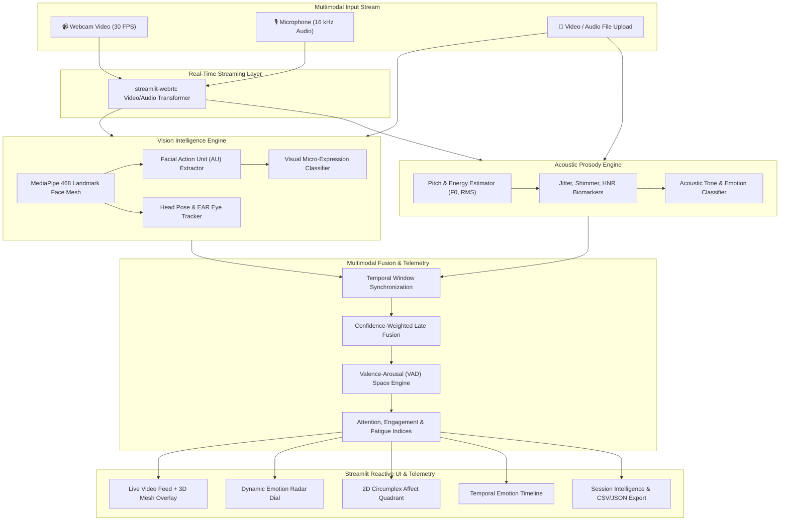

# 🎭🧠 EmotionSense

<div align="center">

[](https://www.python.org/)
[](https://streamlit.io/)
[](https://developers.google.com/mediapipe)
[](https://opencv.org/)
[](https://librosa.org/)
[](LICENSE)

**Enterprise-Grade Real-Time Multimodal Emotion Recognition & Affective Telemetry Intelligence Platform**

[Features](#-key-features) • [Architecture](#-architecture--data-flow) • [Tech Stack](#-technology-stack) • [Quickstart](#-quickstart--installation) • [Project Structure](#-project-structure) • [Testing](#-running-tests)

</div>

---

## 📌 Overview

Human communication is inherently multimodal: over 80% of emotional context is conveyed through non-verbal cues (facial micro-expressions, gaze) and vocal prosody (pitch, jitter, shimmer, acoustic energy). Traditional text-only sentiment tools miss this vital spectrum.

**EmotionSense** is a high-performance, **Pure Python Full-Stack** affective intelligence platform. It captures live webcam video and microphone audio streams, extracts granular computer vision and acoustic features in real time, and fuses them into a unified **Valence-Arousal-Dominance (VAD)** emotional coordinate space alongside real-time behavioral indices (Attention, Engagement, and Fatigue).

---

## 🚀 Key Features

### 👁️ Computer Vision & Facial Micro-Expression Tracking
- **468-Point 3D Face Mesh**: Sub-millimeter landmark tracking via Google MediaPipe.
- **Facial Action Unit (AU) Decoding**: Computes dynamic Action Units (AU1 Inner Brow Raiser, AU4 Brow Lowerer, AU12 Lip Corner Puller, AU15 Lip Corner Depressor, AU25/26 Jaw Drop, AU45 Blink).
- **Head Pose & Eye Aspect Ratio (EAR)**: Real-time pitch, yaw, roll estimation and blink/fatigue rate analysis.
- **8-Class Micro-Expression Classifier**: Continuous probabilistic estimation across *Joy, Sadness, Anger, Fear, Surprise, Disgust, Contempt, and Neutral*.

### 🎙️ Acoustic Prosody & Vocal Tone Analysis
- **Fundamental Frequency (F0 / Pitch)**: Tracks pitch contour, mean pitch, standard deviation, and dynamic range in Hertz.
- **Energy & Dynamics (RMS)**: Root-mean-square acoustic energy and vocal intensity tracking.
- **Voice Quality Biomarkers**: Cycle-to-cycle frequency variation (Jitter), amplitude perturbation (Shimmer), and Harmonic-to-Noise Ratio (HNR).
- **Vocal Emotion Classifier**: Detects acoustic arousal, excitement, distress, calm, and hesitancy.

### ⚡ Multimodal Fusion Engine
- **Temporal Alignment**: Synchronizes asynchronous video frames (30 FPS) and audio buffers (16 kHz PCM) with sliding temporal windows.
- **Dynamic Late Fusion**: Confidence-weighted fusion combining visual and acoustic signals with fallbacks for unimodal inputs.
- **Affective State Modeling**: Maps fused emotions into continuous 2D/3D **Circumplex Affect Space** (Valence & Arousal).
- **Behavioral Telemetry**:
  - 🎯 **Attention Score (0–100%)**: Head alignment, eye contact stability, and blink consistency.
  - ⚡ **Engagement Index (0–100%)**: Emotional dynamic range, expressiveness, and vocal vitality.
  - 🔋 **Fatigue Level (0–100%)**: Eye closure duration (PERCLOS), head droop, and prosodic monotony.

### 📊 Real-Time Interactive Telemetry & Studio
- **Live Stream Studio (`streamlit-webrtc`)**: Low-latency bi-directional browser media streaming with 3D mesh overlays.
- **Interactive Plotly Visualizations**:
  - Dynamic 8-Emotion Spider/Radar chart.
  - 2D Circumplex Valence-Arousal quadrant with live trace history.
  - Multi-stream real-time temporal timelines for emotion drift.
  - Circular gauge dials for Attention, Engagement, and Fatigue.
- **Offline File Analysis**: Ingest MP4, AVI, MOV videos or WAV, MP3 audio files with frame-by-frame affective diagnostics.
- **Session Intelligence & Export**: Full timeline scrubbing, affective summaries, dominant emotion logs, and instantaneous CSV/JSON report downloads.

---

## 🏗️ Architecture & Data Flow



---

## 🛠️ Technology Stack

| Domain | Technology | Description |
| :--- | :--- | :--- |
| **Framework & UI** | [Streamlit](https://streamlit.io/) | Reactive web framework with custom dark glassmorphism styling |
| **Streaming & I/O** | [streamlit-webrtc](https://github.com/whitphx/streamlit-webrtc) / [PyAV](https://github.com/PyAV-Org/PyAV) | Low-latency WebRTC video and audio frame transformation |
| **Computer Vision** | [Google MediaPipe](https://developers.google.com/mediapipe) / [OpenCV](https://opencv.org/) | 468-point 3D face mesh, landmark geometry, and video rendering |
| **Acoustic Analysis** | [Librosa](https://librosa.org/) / [SciPy](https://scipy.org/) / [SoundFile](https://python-soundfile.readthedocs.io/) | Audio DSP, pitch extraction (pyin/yin), jitter, shimmer, spectrograms |
| **Telemetry & Visuals** | [Plotly](https://plotly.com/python/) | Interactive WebGL-accelerated radar dials, affect quadrants, timelines |
| **Data & Core Math** | [NumPy](https://numpy.org/) / [Pandas](https://pandas.pydata.org/) | High-speed array vectorization and session data frames |
| **Testing & Quality** | [Pytest](https://docs.pytest.org/) | Automated test suite for vision, audio DSP, and fusion engines |

---

## 📁 Project Structure

```text
EmotionSense/
├── .gitignore                    # Git ignore configuration
├── requirements.txt              # Production dependencies
├── README.md                     # Comprehensive project documentation
├── memory.md                     # Codebase intelligence & architecture memory
├── config.py                     # Global app settings, palette tokens & constants
├── app.py                        # Main Streamlit application entry point & navigation
│
├── src/
│   ├── __init__.py
│   ├── core/
│   │   ├── __init__.py
│   │   ├── config.py             # Model thresholds, fusion weights & categories
│   │   └── types.py              # EmotionData, AffectVector, AudioProsody dataclasses
│   │
│   ├── vision/
│   │   ├── __init__.py
│   │   ├── face_mesh.py          # 468-point MediaPipe face mesh processor
│   │   └── emotion_classifier.py # Action unit geometric classifier & head pose
│   │
│   ├── audio/
│   │   ├── __init__.py
│   │   ├── prosody.py            # Pitch (F0), RMS energy, jitter, shimmer DSP
│   │   └── voice_sentiment.py    # Acoustic sentiment & vocal emotion classifier
│   │
│   ├── fusion/
│   │   ├── __init__.py
│   │   ├── multimodal_fusion.py  # Temporal sliding window late fusion engine
│   │   └── metrics.py            # Attention, Engagement, and Fatigue metrics
│   │
│   ├── ui/
│   │   ├── __init__.py
│   │   ├── styles.py             # Dark glassmorphism CSS injection
│   │   ├── charts.py             # Plotly radar, quadrant, and timeline figures
│   │   ├── components.py         # Metric badges, score gauges, and HUD cards
│   │   └── video_processor.py    # WebRTC VideoTransformer callback
│   │
│   ├── utils/
│   │   ├── __init__.py
│   │   ├── logger.py             # Structured application logging
│   │   └── session_manager.py    # Session state recording, analytics & export
│   │
│   └── pages/
│       ├── 1_Live_Studio.py      # Real-time multimodal streaming studio
│       ├── 2_File_Analysis.py    # Pre-recorded video/audio file diagnostics
│       ├── 3_Session_History.py  # History viewer, timeline scrubbing & reports
│       └── 4_Architecture.py     # System architecture & documentation viewer
│
└── tests/
    ├── __init__.py
    ├── test_vision.py            # Vision pipeline & geometric unit tests
    ├── test_audio.py             # Acoustic DSP & prosody extractor unit tests
    └── test_fusion.py            # Multimodal fusion & metric calculation tests
```

---

## 🏁 Quickstart & Installation

### Prerequisites
- Python 3.10 or higher
- Webcam and microphone (for real-time streaming features)
- Modern web browser with WebRTC support (Chrome, Firefox, Edge, Safari)

### 1. Clone the Repository
```bash
git clone https://github.com/AadityaBhuree/EmotionSense.git
cd EmotionSense
```

### 2. Create and Activate a Virtual Environment
```bash
# Windows
python -m venv venv
venv\Scripts\activate

# macOS / Linux
python3 -m venv venv
source venv/bin/activate
```

### 3. Install Dependencies
```bash
pip install -r requirements.txt
```

### 4. Launch EmotionSense
```bash
streamlit run app.py
```
*The interactive dashboard will open automatically at `http://localhost:8501`.*

---

## 🧪 Running Tests

Validate the full computer vision, audio DSP, and multimodal fusion pipelines using `pytest`:

```bash
pytest
```

To run with verbose output:
```bash
pytest -v
```

---

## 🎯 Use Cases

- **HR & Interview Intelligence**: Evaluate candidate confidence, genuine smiles, stress markers, and emotional stability during interviews.
- **Mental Wellness & Healthcare**: Non-invasive tracking of longitudinal affective patterns, depressive vocal markers, and fatigue.
- **Customer Experience & Sales**: Real-time feedback on customer engagement and sentiment during discovery calls.
- **EdTech & Remote Learning**: Measure student attention span, confusion, and cognitive fatigue in live webinars.

---

## 📄 License

This project is licensed under the [MIT License](LICENSE) — see the LICENSE file for details.

---

## 👤 Author

**Aditya Bhure**  
GitHub: [@AadityaBhuree](https://github.com/AadityaBhuree)
