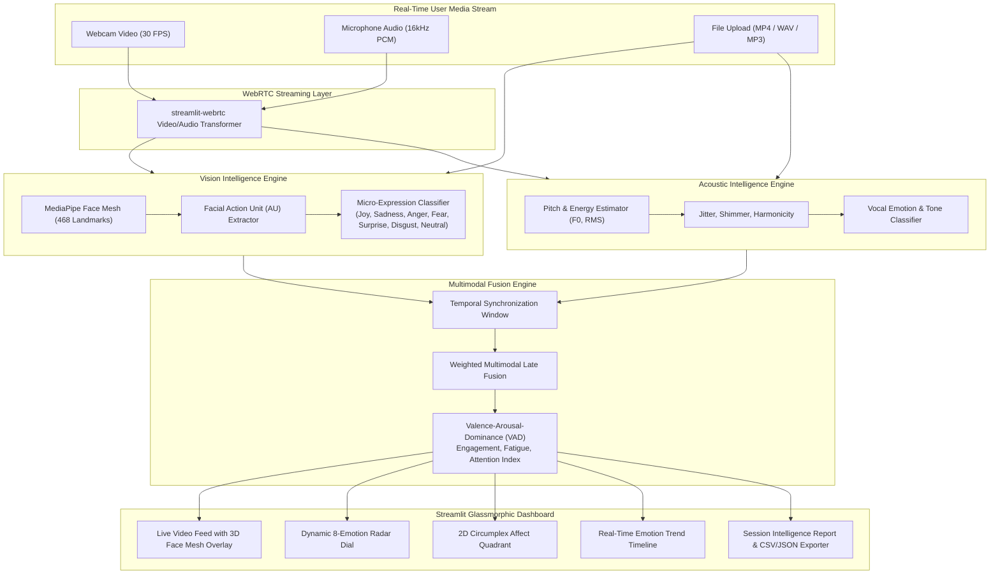

# EmotionSense — Codebase Intelligence & Architecture Memory

> **Status:** Sprint 1 — Pure Python Full-Stack Architecture Execution  
> **Brand & Project:** EmotionSense  
> **Owner:** Aditya Bhure (AadityaBhuree)  
> **Date:** August 2026  

---

## 1. Project Purpose & Executive Summary

### 1.1 What Business Problem is Solved?
Human communication consists of verbal, vocal (pitch, tone, pauses), and non-verbal (facial expressions, micro-gestures) signals. Conventional sentiment analysis tools analyze only static text, missing over 80% of human emotional context. 

**EmotionSense** is an enterprise-grade multimodal emotion recognition and sentiment intelligence platform built in **Pure Python**. It captures, fuses, and analyzes:
1. **Visual / Facial Expressions**: Real-time webcam/video streams detecting micro-expressions (happy, sad, surprised, angry, fearful, disgusted, neutral, contempt) and 468-point facial mesh action units.
2. **Acoustic / Speech Signals**: Voice pitch, jitter, shimmer, tempo, energy, and vocal intonation metrics.
3. **Text / Semantic Content**: Natural language sentiment, affective context nuance, and intent extraction.
4. **Multimodal Fusion**: Real-time Valence-Arousal-Dominance (VAD) coordinate mapping, Engagement Index, Fatigue Level, and Attention Scores.

### 1.2 Target Users & Personas
- **Interview & Talent Assessment Teams**: Evaluating candidate engagement, confidence, and authenticity.
- **Mental Health & Wellness Providers**: Tracking affective response patterns and emotional shifts over time.
- **Customer Experience & Sales Teams**: Live sentiment cues during sales calls and customer service interactions.
- **Researchers & EdTech**: Monitoring student focus, frustration, and engagement levels during live sessions.

---

## 2. Technology Stack

| Domain | Technology / Library | Role & Rationale |
| :--- | :--- | :--- |
| **Framework & UI** | **Streamlit + Precision Neuro-Instrument CSS** | High-performance Python-native reactive workstation with calibrated technical grid and tactile telemetry consoles |
| **Real-Time Video/Audio Stream** | **streamlit-webrtc + AV + WebRTC** | Low-latency bi-directional video and audio stream processing |
| **Computer Vision** | **MediaPipe + OpenCV + NumPy** | 468-point 3D Face Mesh, Facial Action Units (AU), and Micro-expression Classifier |
| **Audio & Acoustics** | **Librosa + SoundFile + SciPy** | Acoustic prosody, fundamental frequency (F0 pitch), RMS energy, jitter & shimmer |
| **Data Visualization & Telemetry** | **Plotly (Graph Objects & Express)** | Dynamic 2D/3D Affect Quadrants, Emotion Radar Charts, Real-time Stream Timelines |
| **State & Session Persistence** | **Streamlit Session State + JSON/CSV** | Live session tracking, recording, timeline scrubbing, and analytics export |

---

## 3. High-Level Architecture Diagram



---

## 4. Repository Structure

```text
EmotionSense/
├── .gitignore                    # Python gitignore
├── requirements.txt              # Production dependencies
├── README.md                     # Project overview and quickstart
├── memory.md                     # Codebase memory and technical documentation
├── config.py                     # Global app configuration & color tokens
├── app.py                        # Streamlit application entry point & sidebar
├── src/
│   ├── __init__.py
│   ├── core/
│   │   ├── __init__.py
│   │   ├── config.py             # Model thresholds, weights & emotion categories
│   │   └── types.py              # EmotionData, AffectVector, AudioProsody dataclasses
│   ├── vision/
│   │   ├── __init__.py
│   │   ├── face_mesh.py          # 468-point MediaPipe face mesh detector
│   │   └── emotion_classifier.py # Facial action unit & expression classifier
│   ├── audio/
│   │   ├── __init__.py
│   │   ├── prosody.py            # Pitch, jitter, shimmer, acoustic energy
│   │   └── voice_sentiment.py    # Acoustic sentiment & vocal emotion classifier
│   ├── fusion/
│   │   ├── __init__.py
│   │   ├── multimodal_fusion.py  # Temporal multimodal late fusion engine
│   │   ├── metrics.py            # Attention, Engagement, and Fatigue indices
│   │   └── anomaly_detector.py   # Affective anomaly & emotional distress sentinel
│   ├── ui/
│   │   ├── __init__.py
│   │   ├── styles.py             # Sleek dark glassmorphism CSS injection
│   │   ├── charts.py             # Plotly radar, quadrant, and timeline charts
│   │   ├── components.py         # Metric badges, status cards, score gauges
│   │   └── video_processor.py    # streamlit-webrtc VideoTransformer
│   ├── utils/
│   │   ├── __init__.py
│   │   ├── logger.py             # Structured logging
│   │   ├── session_manager.py    # Session recording, persistence & export
│   │   └── report_generator.py   # Diagnostic HTML/Markdown clinical report generator
│   └── pages/
│       ├── 1_💬_Text_Studio.py     # Single message, multi-turn chat & batch analysis
│       ├── 2_🎥_Live_Studio.py     # Real-time multimodal streaming studio
│       ├── 3_📁_File_Analysis.py   # Offline video & audio file analysis
│       ├── 4_📑_Session_History.py # Timeline scrubbing, anomaly log & reports
│       └── 5_📐_Architecture.py    # System architecture & multimodal docs
└── tests/
    ├── __init__.py
    ├── test_vision.py
    ├── test_audio.py
    ├── test_fusion.py
    ├── test_anomaly_detector.py
    ├── test_report_generator.py
    ├── test_text_emotion.py
    ├── test_api_server.py
    └── test_transformer_hybrid.py
```
