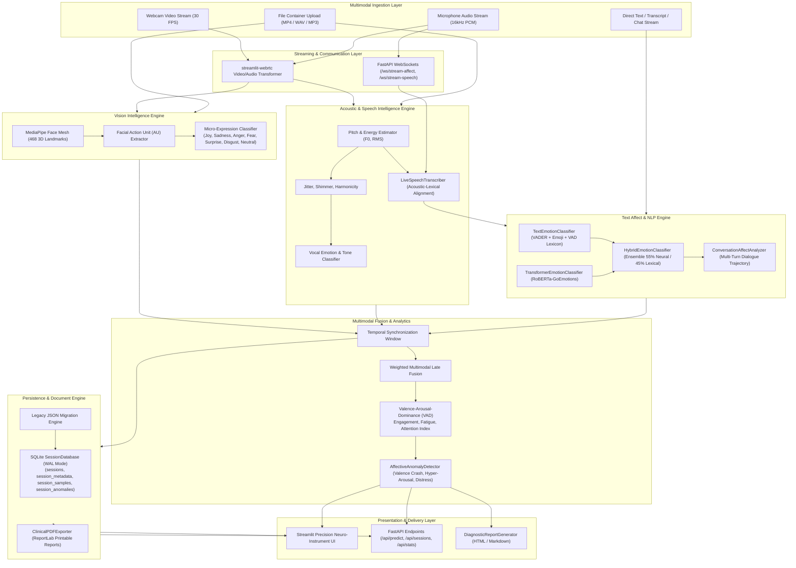

# EmotionSense — Codebase Intelligence & Architecture Memory

> **Status:** Phase 12 Completed — Somatosensory Kinematics, Postural Ergonomics & Micro-Gesture Kinesics (212/212 Tests Passing)  
> **Brand & Project:** EmotionSense  
> **Owner:** Aditya Bhure (AadityaBhuree)  
> **Date:** September 2026  

---

## 1. Project Purpose & Executive Summary

### 1.1 What Business Problem is Solved?
Human communication consists of verbal, vocal (pitch, tone, pauses), and non-verbal (facial expressions, micro-gestures) signals. Conventional sentiment analysis tools analyze only static text, missing over 80% of human emotional context. 

**EmotionSense** is an enterprise-grade multimodal emotion recognition and sentiment intelligence platform built in **Pure Python**. It captures, fuses, and analyzes:
1. **Visual / Facial Expressions**: Real-time webcam/video streams detecting micro-expressions (happy, sad, surprised, angry, fearful, disgusted, neutral, contempt) and 468-point facial mesh action units.
2. **Acoustic / Speech Signals**: Voice pitch, jitter, shimmer, tempo, energy, and vocal intonation metrics.
3. **Text / Semantic Content**: Natural language sentiment, affective context nuance, intent extraction, and conversational trajectory dynamics.
4. **Speech-to-Text & Phonetic Prosody**: Synchronized acoustic-lexical alignment linking live spoken audio buffers to transcribed tokens.
5. **Multimodal Fusion**: Real-time Valence-Arousal-Dominance (VAD) coordinate mapping, Engagement Index, Fatigue Level, Attention Scores, and Affective Anomaly Sentinel detection.
6. **Microservice API**: Production-ready asynchronous FastAPI REST microservice and bi-directional WebSocket streaming gateways.
7. **Enterprise Persistence & Clinical Reporting**: Embedded SQLite storage engine with cascading metadata management, automated legacy JSON sync, and publication-quality Clinical PDF diagnostics via ReportLab.
8. **Edge AI Acceleration & Quantization**: ONNX Runtime hardware provider routing (DirectML, CUDA, CoreML, WASM), dynamic INT8 post-training quantization, and sub-10ms edge latency profiling.
9. **Multimodal Agentic Reasoning & Clinical Copilot**: Pluggable LLM/SLM reasoning engine (RuleBasedExpert 0ms, Ollama local LLaMA 3.2, OpenAI/vLLM, Google Gemini), token-budget compressed telemetry, Chain-of-Thought (CoT) diagnostic synthesis, and an interactive in-studio clinical copilot.
10. **Remote Biometric & Physiological Telemetry (rPPG)**: Contact-free optical photoplethysmography via Plane-Orthogonal-to-Skin (POS) and CHROM algorithms, extracting instantaneous pulse (BPM), Heart Rate Variability (SDNN, RMSSD, pNN50), Baevsky Stress Index, Respiration Rate (RPM via RSA), and unified Autonomic Stress Index without wearable hardware.
11. **Cognitive Workload & Oculomotor Telemetry**: Contact-free pupillometry and Cognitive Pupillary Response (CPR) via MediaPipe iris landmarks, Eye Aspect Ratio (EAR), blink dynamics, PERCLOS drowsiness metric, 3D gaze tracking, I-VT fixation vs. saccade velocity discrimination, gaze dispersion heatmaps, multi-sensor NASA-TLX Mental Overload Index fusion (0.0 to 1.0), and workload tiers.
12. **Somatosensory Kinematics & Postural Ergonomics**: Real-time upper-body spinal alignment tracking (Forward Head Posture angle, Slump Index, lateral tilt, shoulder elevation asymmetry), hand-to-face micro-gesture self-touch adaptors (chin support, mouth cover, temple rub, eye rub, neck touch), kinetic restlessness / fidgeting spectral flux, and composite Psychomotor Agitation Index (PAI) multi-sensor fusion.

### 1.2 Target Users & Personas
- **Interview & Talent Assessment Teams**: Evaluating candidate engagement, confidence, stress resilience, and authenticity.
- **Mental Health & Wellness Providers**: Longitudinal tracking of affective response patterns, hyper-arousal spikes, and valence crashes with formal clinical PDF records.
- **Customer Experience & Sales Teams**: Real-time sentiment cues, conversational trajectory escalation alerts, and empathy guidance.
- **Researchers & EdTech**: Monitoring student focus, cognitive overload, fatigue, and engagement levels during live sessions.
- **Edge & Mobile Engineers**: On-device edge runtime profiling, INT8 model quantization, and zero-cloud deployment.

---

## 2. Technology Stack

| Domain | Technology / Library | Role & Rationale |
| :--- | :--- | :--- |
| **Framework & UI** | **Streamlit + Precision Neuro-Instrument CSS** | Reactive workstation with calibrated technical grid, Russell circumplex vector trails, and tactile telemetry consoles |
| **Edge AI Acceleration** | **ONNX Runtime + NumPy Vectorization** | Multi-backend hardware provider abstraction (DirectML, CUDA, CoreML, CPU, WASM) and dynamic INT8 post-training quantization |
| **Microservice Backend** | **FastAPI + Uvicorn + WebSockets + HTTPX** | Asynchronous high-throughput REST API and bi-directional streaming endpoints for telemetry, live speech, and session persistence |

| **Real-Time Video/Audio Stream** | **streamlit-webrtc + PyAV (`av`) + WebRTC** | Low-latency bi-directional video and audio frame transformation and container demuxing |
| **Computer Vision** | **MediaPipe + OpenCV + NumPy** | 468-point 3D Face Mesh, Facial Action Units (AU), and Micro-expression Classifier |
| **Audio & Acoustics** | **Librosa + SoundFile + SciPy** | Acoustic prosody, fundamental frequency (F0 pitch), RMS energy, jitter & shimmer |
| **NLP & Deep Transformers** | **RoBERTa / GoEmotions + PyTorch + Lexical VAD** | Hybrid Ensemble Emotion Classifier blending rule-based emoji/negation precision with neural contextual embeddings |
| **Speech Processing** | **SpeechRecognition + Acoustic Buffering** | Chunked PCM audio stream transcription with phonetic word-level prosodic alignment |
| **Data Visualization & Telemetry** | **Plotly (Graph Objects & Express)** | Dynamic Russell 2D Circumplex, Action Unit bar charts, radar dials, and real-time timelines |
| **Anomaly & Reporting** | **Statistical Z-Score Sentinel + Markdown/HTML** | Autonomous affective distress detection (valence crashes, hyper-arousal, attention collapse) and clinical reports |
| **Database & Persistence** | **SQLite3 (WAL Mode) + JSON/CSV** | ACID-compliant relational persistence for sessions, candidates, timeline samples, and affective anomaly history |
| **Clinical PDF Export** | **ReportLab** | Publication-grade printable PDF diagnostic evaluation dossiers with metadata blocks, VAD tables, and audit sign-off |
| **Code Quality & CI/CD** | **Ruff + Docker Buildx + GitHub Actions** | Lightning-fast static analysis, formatting, coverage reporting, and container build validation |

---

## 3. High-Level Architecture Diagram



---

## 4. Repository Structure

```text
EmotionSense/
├── .github/
│   └── workflows/
│       └── ci.yml                     # GitHub Actions CI with Ruff, Pytest-cov & Docker build
├── .gitignore                         # Git exclusion rules (venv, *.db, data/, cache)
├── requirements.txt                   # Production dependencies (Streamlit, FastAPI, WebSockets, AV, ReportLab, etc.)
├── Dockerfile                         # Multi-stage production container definition
├── docker-compose.yml                 # Docker service orchestration
├── README.md                          # Repository overview and setup instructions
├── memory.md                          # System memory, architecture, and sprint logs
├── config.py                          # Global application tokens, paths (DB_PATH), and theme palette
├── app.py                             # Streamlit entry point, telemetry HUD, and navigation
├── server.py                          # FastAPI REST microservice and WebSocket streaming server
├── src/
│   ├── __init__.py
│   ├── core/
│   │   ├── __init__.py
│   │   ├── config.py                  # Thresholds, modality weights, and taxonomy definitions
│   │   └── types.py                   # Pydantic & dataclass definitions (AffectVector, SessionRecord, etc.)
│   ├── storage/
│   │   ├── __init__.py                # Exported storage engine and models
│   │   ├── models.py                  # AssessmentType, SessionMetadata, StoredSession dataclasses
│   │   └── db.py                      # SQLite SessionDatabase engine with WAL mode, CRUD & migrations
│   ├── vision/
│   │   ├── __init__.py
│   │   ├── face_mesh.py               # 468-point MediaPipe face mesh processor
│   │   └── emotion_classifier.py      # Action Unit geometric heuristics & expression classifier
│   ├── audio/
│   │   ├── __init__.py
│   │   ├── prosody.py                 # F0 pitch, RMS energy, jitter, and shimmer extraction
│   │   ├── voice_sentiment.py         # Acoustic sentiment and vocal affect classifier
│   │   └── speech_transcriber.py      # Live speech recognition & phonetic prosody alignment
│   ├── text/
│   │   ├── __init__.py                # Exported text classifiers and conversation analyzers
│   │   ├── nlp_emotion.py             # Lexical VAD, emoji dictionary, and negation parser
│   │   ├── transformer_emotion.py     # Deep learning RoBERTa-GoEmotions classifier with SEH protection
│   │   ├── hybrid_classifier.py       # Ensemble neural-lexical blender (55% neural / 45% lexical)
│   │   └── conversation_analyzer.py   # Multi-turn conversational trajectory & empathy engine
│   ├── fusion/
│   │   ├── __init__.py
│   │   ├── multimodal_fusion.py       # Tri-modal late fusion engine
│   │   ├── metrics.py                 # Engagement, Attention, and Fatigue indices
│   │   └── anomaly_detector.py        # Affective anomaly & emotional distress sentinel
│   ├── ui/
│   │   ├── __init__.py
│   │   ├── styles.py                  # Neuro-instrument CSS, glassmorphic HUD styling
│   │   ├── charts.py                  # Plotly Russell Circumplex, AU spectrum, and radar charts
│   │   ├── components.py              # Telemetry badges, tactile status dials, and gauges
│   │   └── video_processor.py         # WebRTC VideoTransformer with landmark overlay
│   ├── utils/
│   ├── edge/
│   │   ├── __init__.py                # Exported edge inference, quantizer, and benchmark suite
│   │   ├── runtime.py                 # ONNXEdgeInferenceEngine with hardware provider routing & warm-up
│   │   ├── quantizer.py               # ModelQuantizationOptimizer for MinMax INT8/FP16 compression
│   │   └── benchmark.py               # EdgeBenchmarkSuite with P50/P95/P99 latency stress testing
│   ├── ui/
│   │   ├── __init__.py
│   │   ├── styles.py                  # Neuro-instrument CSS, glassmorphic HUD styling
│   │   ├── charts.py                  # Plotly Russell Circumplex, AU spectrum, and radar charts
│   │   ├── components.py              # Telemetry badges, tactile status dials, and gauges
│   │   └── video_processor.py         # WebRTC VideoTransformer with landmark overlay
│   ├── utils/
│   │   ├── __init__.py
│   │   ├── logger.py                  # Structured application logging
│   │   ├── session_manager.py         # Session recording, persistence & JSON export
│   │   ├── report_generator.py        # Diagnostic HTML & Markdown clinical report generator
│   │   ├── pdf_exporter.py            # Publication-grade Clinical PDF report exporter via ReportLab
│   │   ├── demuxer.py                 # Audiovisual container demuxer (PyAV)
│   │   └── ws_client.py               # Asynchronous WebSocket client for affect and speech streams
│   └── pages/
│       ├── 1_💬_Text_Studio.py          # Single message, multi-turn chat & batch analysis
│       ├── 2_🎥_Live_Studio.py          # Real-time multimodal streaming studio
│       ├── 3_📁_File_Analysis.py        # Offline video & audio file container analysis
│       ├── 4_📑_Session_History.py      # Timeline scrubbing, SQLite persistence, metadata editor & PDF export
│       ├── 5_📐_Architecture.py         # System architecture & multimodal documentation
│       ├── 6_📈_Longitudinal_Analytics.py # Multi-session clinical drift & cohort intelligence
│       └── 7_⚡_Edge_Studio.py           # Sub-10ms edge inference, ONNX routing & INT8 quantization
├── scripts/
│   └── ws_stream_client.py            # CLI utility for real-time WebSocket telemetry testing
└── tests/
    ├── __init__.py
    ├── test_vision.py                 # MediaPipe landmarks, AU boundaries & null frame handling
    ├── test_audio.py                  # Pitch estimation, silence handling, voice sentiment
    ├── test_text_emotion.py           # Lexical VAD, emoji extraction, negation handling
    ├── test_transformer_hybrid.py     # Transformer availability, mode switching, ensemble fusion
    ├── test_speech_transcriber.py     # Audio buffer processing, speech transcription stream
    ├── test_demuxer.py                # Audiovisual demuxing, synchronized timeline & late fusion
    ├── test_webrtc_stream.py          # WebRTC audio resampling, prosody, transcript & HUD subtitles
    ├── test_ws_client.py              # WebSocket streaming client tests (URL construction, flow)
    ├── test_fusion.py                 # Multimodal late fusion, attention penalty, VAD quadrant
    ├── test_anomaly_detector.py       # Valence crash, hyper-arousal, sustained distress, fatigue
    ├── test_report_generator.py       # Markdown and HTML clinical diagnostic report formatting
    ├── test_storage.py                # SQLite schema, CRUD, cascade delete, JSON migration & stats
    ├── test_pdf_exporter.py           # ReportLab compilation, magic bytes, filesystem save & empty sessions
    ├── test_edge_runtime.py           # ONNX execution provider routing, device profiling & warm-up
    ├── test_edge_quantizer.py         # Dynamic MinMax INT8 scaling, cosine similarity & compression
    ├── test_ui_edge_charts.py         # Edge latency waterfall, quantization comparison & throughput gauges
    └── test_api_server.py             # FastAPI REST endpoints, session CRUD & WebSocket streaming
```

---

## 5. API Endpoints Reference (`server.py`)

### 5.1 REST Endpoints

| Method | Path | Description | Request Body | Response |
| :--- | :--- | :--- | :--- | :--- |
| `GET` | `/health` | Microservice health check & engine readiness | None | `{"status": "healthy", "service": "EmotionSense API", "version": "2.0.0"}` |
| `POST` | `/api/predict/text` | Single text message affect & VAD prediction | `SingleTextRequest` (`text`, `mode`) | `TextEmotionResult` |
| `POST` | `/api/analyze/dialogue` | Multi-turn conversational trajectory & empathy advice | `DialogueTranscriptRequest` (`transcript`) | `DialogueEmotionSummary` |
| `POST` | `/api/batch/predict` | Batch text list affect processing | `BatchTextRequest` (`texts`, `mode`) | `List[TextEmotionResult]` |
| `POST` | `/api/anomalies/detect` | Affective anomaly detection across session frames | `AnomalyDetectionRequest` (`history`, `sample_rate`) | `List[Dict[str, Any]]` |
| `POST` | `/api/reports/generate` | Automated clinical diagnostic report export | `ReportGenerationRequest` (`session_data`, `format`) | `{"format": "html", "report": "..."}` |
| `GET` | `/api/sessions` | Query persisted sessions with filters & pagination | Query: `assessment_type`, `tag`, `search`, `limit`, `offset` | `{"count": int, "sessions": [...]}` |
| `GET` | `/api/sessions/{id}` | Get complete session details with timeline samples | Query: `include_samples` | `StoredSession` dictionary |
| `POST` | `/api/sessions` | Save or update session record in SQLite | `SaveSessionRequest` | `{"status": "success", "session_id": "..."}` |
| `PATCH` | `/api/sessions/{id}/metadata` | Update session clinical metadata, notes, and tags | `MetadataUpdateRequest` | `{"status": "success", "session_id": "..."}` |
| `DELETE` | `/api/sessions/{id}` | Delete session and cascading samples from database | None | `{"status": "success", "deleted_session_id": "..."}` |
| `POST` | `/api/sessions/migrate` | Trigger migration of legacy JSON sessions to SQLite | None | `{"status": "success", "migrated_sessions_count": int}` |
| `GET` | `/api/stats` | Retrieve platform-wide metrics and assessment type counts | None | `{"status": "success", "stats": {...}}` |
| `GET` | `/api/edge/hardware` | Retrieve edge hardware profile & active execution providers | None | `{"status": "success", "profile": {...}}` |
| `POST` | `/api/edge/benchmark` | Execute edge latency benchmark across iterations | `EdgeBenchmarkRequest` | `{"status": "success", "benchmark": {...}}` |
| `POST` | `/api/edge/quantize` | Estimate model INT8 quantization compression & speedup | `EdgeQuantizeRequest` | `{"status": "success", "quantization": {...}}` |
| `POST` | `/api/biometrics/rppg` | Compute pulse and HRV from raw RGB frame series | `RPPGRequest` (`rgb_series`, `fps`) | `{"status": "success", "telemetry": {...}}` |
| `POST` | `/api/biometrics/stress` | Compute unified autonomic stress index from parameters | `StressRequest` (`pulse`, `hrv`, `respiration`, `valence`, `arousal`) | `{"status": "success", "stress": {...}}` |
| `GET` | `/api/biometrics/config` | Retrieve optical filtering and hardware SLA configuration | None | `{"status": "success", "config": {...}}` |
| `POST` | `/api/somatosensory/kinematics` | Process upper-body posture landmarks and micro-gesture adaptors | `SomatosensoryKinematicsRequest` (`face_anchor`, `torso_landmarks`, `hands`) | `{"status": "success", "snapshot": {...}}` |
| `POST` | `/api/somatosensory/agitation` | Compute composite Psychomotor Agitation Index (PAI) late fusion | `SomatosensoryAgitationRequest` (`posture`, `adaptor`, `fidgeting`, `stress`) | `{"status": "success", "agitation": {...}}` |
| `GET` | `/api/somatosensory/config` | Retrieve ergonomic angles, adaptor thresholds, and PAI SLA specs | None | `{"status": "success", "config": {...}}` |

### 5.2 WebSocket Streaming Endpoints

| Protocol | Path | Description | Payload Format |
| :--- | :--- | :--- | :--- |
| `WS` | `/ws/stream-affect` | Real-time bi-directional affect streaming | JSON message: `{"text": "..."}` $\rightarrow$ JSON telemetry response |
| `WS` | `/ws/stream-speech` | Live audio streaming for transcription and phonetic affect | JSON chunk: `{"audio_chunk": "..."}` $\rightarrow$ JSON transcription + prosody response |
| `POST` | `/api/analyze/dyadic` | Dyadic interaction synchrony, floor balance & rapport scoring | `DyadicAnalysisRequest` (samples_a, samples_b, diarization) | `DyadicInteractionMetrics` |
| `POST` | `/api/audio/diarize` | Multi-speaker acoustic segmentation and turn-taking | `AudioDiarizeRequest` (audio_base64, sample_rate, num_speakers) | `DiarizationResult` |

---

## 6. Verification & Quality Metrics

All **212** unit, integration, persistence, dyadic, deep SER, cross-modal attention, longitudinal, edge runtime, agentic copilot, biometric rPPG, cognitive workload, and somatosensory kinematics tests pass cleanly across Python 3.10+:

```bash
pytest -v
# ============================ 212 passed in 16.83s =============================
```

- **Somatosensory Kinematics & Ergonomics Suite (`test_somatosensory.py`)**: Forward Head Posture angle ($\theta_{\text{FHP}}$), Slump Index ($S_{\text{slump}}$), coronal lateral tilt, shoulder elevation tension asymmetry, hand-to-face micro-gesture adaptors (Chin Support, Mouth Cover, Temple Rub, Eye Rub, Neck Touch, Cheek Touch), kinetic restlessness / fidgeting spectral flux, gesticulation expressivity, and composite Psychomotor Agitation Index (PAI) multi-sensor fusion.
- **Somatosensory UI Visualizations Suite (`test_ui_somatosensory_charts.py`)**: Upper-body postural alignment schematic diagrams, hand-to-face adaptor occurrence timelines, kinetic fidgeting energy waveforms, semicircular PAI tachometer gauges, and tactical somatosensory HUD HTML.
- **Edge Benchmark Somatosensory SLA (`test_edge_runtime.py`)**: Real-time validation of the sub-3.5ms somatosensory kinematics and PAI fusion execution SLA with P50/P95/P99 latency profiling.
- **Cognitive Workload & Oculomotor Telemetry Suite (`test_cognitive_workload.py`)**: MediaPipe iris pupil diameter and Pupil-to-Iris Ratio (PIR), Eye Aspect Ratio (EAR), blink dynamics and PERCLOS drowsiness detection, 3D gaze velocity tracking with I-VT fixation vs. saccade discrimination, and 6-factor NASA-TLX composite mental overload fusion.
- **Cognitive UI Visualizations Suite (`test_ui_cognitive_charts.py`)**: Gaze dispersion spatial heatmaps, NASA-TLX dimensional radar spider charts, semicircular cognitive workload gauge with workload tiers, and tactical Oculomotor HUD HTML.
- **Remote Biometrics Suite (`test_biometrics.py`)**: Plane-Orthogonal-to-Skin (POS) chroma extraction, Butterworth 2nd-order bandpass filtering, FFT spectral and time-domain peak detection, HRV (SDNN, RMSSD, pNN50, Baevsky Stress Index), Respiration Sinus Arrhythmia (RSA), and multi-sensor Autonomic Stress late fusion.
- **Biometric UI Visualizations Suite (`test_ui_biometric_charts.py`)**: Real-time BVP photoplethysmogram waveforms, systolic peak markers, HRV Poincaré ($RR_n \text{ vs } RR_{n+1}$) scatter plots, semicircular autonomic stress tachometer gauges, sympathetic/parasympathetic tone balance bars, and longitudinal multi-session RHR/RMSSD drift charts.
- **Clinical Agent Reasoning Suite (`test_clinical_agent.py`)**: Chain-of-Thought prompt synthesis, timeline compression, turning point detection, live distress triage, multi-turn copilot Q&A, and graceful fallback.
- **Agent Microservice API Suite (`test_api_server.py`)**: `/api/agent/providers`, `/api/agent/synthesize`, and `/api/agent/chat` validation.
- **Edge Runtime Suite (`test_edge_runtime.py`)**: Multi-provider execution routing (DirectML, CUDA, CPU, WASM), hardware profile introspection, warm-up pass timing, and fallback validation.
- **Model Quantization Suite (`test_edge_quantizer.py`)**: Mathematical symmetric and asymmetric MinMax integer scaling, cosine similarity retention, and catalog compression verification.
- **Edge UI Visualizations Suite (`test_ui_edge_charts.py`)**: P50/P95/P99 latency waterfall waveforms, FP32 vs INT8 memory comparison charts, and real-time throughput FPS dials.
- **Longitudinal Analytics Suite (`test_longitudinal_analytics.py`)**: OLS valence progression slopes, affective volatility indices, recovery rate time constants, and normative cohort percentile mapping.
- **Longitudinal UI Charts Suite (`test_ui_longitudinal_charts.py`)**: Trajectory regression waveforms, cohort volatility radar polar chart, and recovery time gauge.
- **Deep Speech Emotion Suite (`test_deep_ser.py`)**: Multi-tier neural/ONNX execution, wav2vec2 feature extraction, and acoustic fallback.
- **Cross-Modal Attention Suite (`test_cross_modal_fusion.py`)**: Multi-head cross-attention projections, modality congruence scores, and masked affect detection.
- **Multi-Face Tracking Suite (`test_multi_face_tracker.py`)**: Persistent spatial centroid tracking, IoU matching, multi-face FACS Action Units, disappearance grace periods, and HUD corner overlay rendering.
- **Acoustic Diarization Suite (`test_diarizer.py`)**: Short-time energy VAD segmentation, spectral + MFCC embeddings, multi-speaker clustering, turn merging, speaking duration, conversational dominance ratio, and interruption detection.
- **Dyadic Interaction Dynamics Suite (`test_interaction_dynamics.py`)**: Temporal grid interpolation, Pearson valence/arousal cross-correlation, lagged facial smile mimicry (0.5s–2.5s), turn transition latency, mutual attentiveness, and Dyadic Rapport Index scoring.
- **Dyadic UI Visualizations Suite (`test_ui_dyadic_charts.py`)**: Synchronized dual-valence Plotly waveforms, conversational floor share donut, semicircular rapport gauge, and alternating speaker turn timeline bars.
- **Persistence & Database Suite (`test_storage.py`)**: Schema creation, table constraints, transaction rollbacks, index verification, session upsert, metadata updates, cascade deletion, legacy JSON file migration, and platform stats calculation.
- **Clinical PDF Exporter Suite (`test_pdf_exporter.py`)**: ReportLab document compilation, PDF magic bytes validation (`%PDF-`), multi-page layout generation, embedded VAD tables, dyadic interpersonal synchrony table, anomaly blocks, clinical sign-off, filesystem saving, and empty session resilience.
- **Vision Suite (`test_vision.py`)**: MediaPipe landmark tolerances, AU bounds, null frame handling.
- **Audio Suite (`test_audio.py`)**: F0 pitch frequency estimation, silence thresholds, vocal sentiment.
- **Text & Transformer Suite (`test_text_emotion.py`, `test_transformer_hybrid.py`)**: Lexical VAD, emoji affect, negation inversions, protected PyTorch DLL SEH handling, hybrid ensemble blending.
- **Speech Transcriber Suite (`test_speech_transcriber.py`)**: Audio byte and numpy array transcription, mocked speech recognition, phonetic token alignment with acoustic pitch and energy, and offline fallback resilience.
- **Audiovisual Demuxer Suite (`test_demuxer.py`)**: Container demuxing, synthetic video/audio generation, corrupted input resilience, audio window extraction, synchronized timeline generation, and audiovisual late fusion.
- **WebRTC Stream Suite (`test_webrtc_stream.py`)**: Multimodal stream context thread safety, synthetic PyAV audio frame resampling, vocal prosody, autonomous speech recognition worker, live subtitle rendering, and multi-face tracking mode.
- **WebSocket Streaming Suite (`test_ws_client.py`, `test_api_server.py`)**: URL construction, bidirectional `/ws/stream-affect` telemetry, and base64 audio chunk / JSON text `/ws/stream-speech` streaming.
- **Multimodal Fusion (`test_fusion.py`)**: Temporal alignment, attention penalty weighting, continuous 3D VAD mapping.
- **Sentinel Anomaly Suite (`test_anomaly_detector.py`)**: Valence crash, hyper-arousal spikes, sustained distress, cognitive fatigue overload.
- **Reporting Suite (`test_report_generator.py`)**: Clinical Markdown and responsive HTML diagnostic generation.
- **API Server Suite (`test_api_server.py`)**: FastAPI REST routes, edge hardware/benchmark/quantize endpoints, full session persistence lifecycle, dyadic interaction analysis endpoint, audio diarization endpoint, and bidirectional WebSocket affect & speech streaming.
- **Static Code Analysis (`ruff check .`)**: Zero linting or formatting errors across entire repository.

