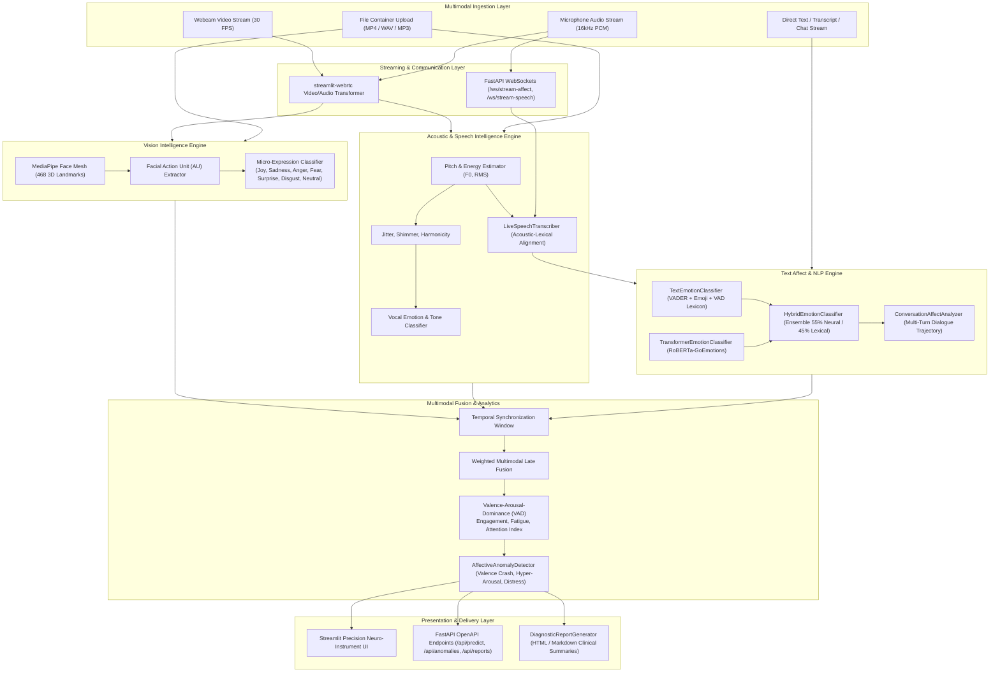

# EmotionSense — Codebase Intelligence & Architecture Memory

> **Status:** Sprint 2 Completed — Full-Stack Multimodal Neural & Microservice Architecture  
> **Brand & Project:** EmotionSense  
> **Owner:** Aditya Bhure (AadityaBhuree)  
> **Date:** September 2026  

---

## 1. Project Purpose & Executive Summary

### 1.1 What Business Problem is Solved?
Human communication consists of verbal, vocal (pitch, tone, pauses), and non-verbal (facial expressions, micro-gestures) signals. Conventional sentiment analysis tools analyze only static text, missing over 80% of human emotional context. 

**EmotionSense** is an enterprise-grade multimodal emotion recognition and sentiment intelligence platform built in **Pure Python**. It captures, fuses, and analyzes:
1. **Visual / Facial Expressions**: Real-time webcam/video streams detecting micro-expressions (happy, sad, surprised, angry, fearful, disgusted, neutral, contempt) and 468-point facial mesh action units.
2. **Acoustic / Speech Signals**: Voice pitch, jitter, shimmer, tempo, energy, and vocal intonation metrics.
3. **Text / Semantic Content**: Natural language sentiment, affective context nuance, intent extraction, and conversational trajectory dynamics.
4. **Speech-to-Text & Phonetic Prosody**: Synchronized acoustic-lexical alignment linking live spoken audio buffers to transcribed tokens.
5. **Multimodal Fusion**: Real-time Valence-Arousal-Dominance (VAD) coordinate mapping, Engagement Index, Fatigue Level, Attention Scores, and Affective Anomaly Sentinel detection.
6. **Microservice API**: Production-ready asynchronous FastAPI REST microservice and bi-directional WebSocket streaming gateways.

### 1.2 Target Users & Personas
- **Interview & Talent Assessment Teams**: Evaluating candidate engagement, confidence, stress resilience, and authenticity.
- **Mental Health & Wellness Providers**: Longitudinal tracking of affective response patterns, hyper-arousal spikes, and valence crashes.
- **Customer Experience & Sales Teams**: Real-time sentiment cues, conversational trajectory escalation alerts, and empathy guidance.
- **Researchers & EdTech**: Monitoring student focus, cognitive overload, fatigue, and engagement levels during live sessions.

---

## 2. Technology Stack

| Domain | Technology / Library | Role & Rationale |
| :--- | :--- | :--- |
| **Framework & UI** | **Streamlit + Precision Neuro-Instrument CSS** | Reactive workstation with calibrated technical grid, Russell circumplex vector trails, and tactile telemetry consoles |
| **Microservice Backend** | **FastAPI + Uvicorn + WebSockets + HTTPX** | Asynchronous high-throughput REST API and bi-directional streaming endpoints for telemetry and live speech |
| **Real-Time Video/Audio Stream** | **streamlit-webrtc + PyAV (`av`) + WebRTC** | Low-latency bi-directional video and audio frame transformation and container demuxing |
| **Computer Vision** | **MediaPipe + OpenCV + NumPy** | 468-point 3D Face Mesh, Facial Action Units (AU), and Micro-expression Classifier |
| **Audio & Acoustics** | **Librosa + SoundFile + SciPy** | Acoustic prosody, fundamental frequency (F0 pitch), RMS energy, jitter & shimmer |
| **NLP & Deep Transformers** | **RoBERTa / GoEmotions + PyTorch + Lexical VAD** | Hybrid Ensemble Emotion Classifier blending rule-based emoji/negation precision with neural contextual embeddings |
| **Speech Processing** | **SpeechRecognition + Acoustic Buffering** | Chunked PCM audio stream transcription with phonetic word-level prosodic alignment |
| **Data Visualization & Telemetry** | **Plotly (Graph Objects & Express)** | Dynamic Russell 2D Circumplex, Action Unit bar charts, radar dials, and real-time timelines |
| **Anomaly & Reporting** | **Statistical Z-Score Sentinel + Markdown/HTML** | Autonomous affective distress detection (valence crashes, hyper-arousal, attention collapse) and clinical reports |
| **State & Persistence** | **Streamlit Session State + JSON/CSV** | Session recording, timeline scrubbing, and diagnostic export |

---

## 3. High-Level Architecture Diagram



---

## 4. Repository Structure

```text
EmotionSense/
├── .gitignore                         # Git exclusion rules
├── requirements.txt                   # Production dependencies (Streamlit, FastAPI, WebSockets, AV, etc.)
├── Dockerfile                         # Multi-stage production container definition
├── docker-compose.yml                 # Docker service orchestration
├── README.md                          # Repository overview and setup instructions
├── memory.md                          # System memory, architecture, and sprint logs
├── config.py                          # Global application tokens and configuration
├── app.py                             # Streamlit entry point, telemetry HUD, and navigation
├── server.py                          # FastAPI REST microservice and WebSocket streaming server
├── src/
│   ├── __init__.py
│   ├── core/
│   │   ├── __init__.py
│   │   ├── config.py                  # Thresholds, modality weights, and taxonomy definitions
│   │   └── types.py                   # Pydantic & dataclass definitions (AffectVector, TextEmotionResult, etc.)
│   ├── vision/
│   │   ├── __init__.py
│   │   ├── face_mesh.py               # 468-point MediaPipe face mesh processor
│   │   └── emotion_classifier.py      # Action Unit geometric heuristics & expression classifier
│   ├── audio/
│   │   ├── __init__.py
│   │   ├── prosody.py                 # F0 pitch, RMS energy, jitter, and shimmer extraction
│   │   ├── voice_sentiment.py         # Acoustic sentiment and vocal affect classifier
│   │   └── speech_transcriber.py      # Live speech recognition & phonetic prosody alignment
│   ├── text/
│   │   ├── __init__.py                # Exported text classifiers and conversation analyzers
│   │   ├── nlp_emotion.py             # Lexical VAD, emoji dictionary, and negation parser
│   │   ├── transformer_emotion.py     # Deep learning RoBERTa-GoEmotions classifier with SEH protection
│   │   ├── hybrid_classifier.py       # Ensemble neural-lexical blender (55% neural / 45% lexical)
│   │   └── conversation_analyzer.py   # Multi-turn conversational trajectory & empathy engine
│   ├── fusion/
│   │   ├── __init__.py
│   │   ├── multimodal_fusion.py       # Tri-modal late fusion engine
│   │   ├── metrics.py                 # Engagement, Attention, and Fatigue indices
│   │   └── anomaly_detector.py        # Affective anomaly & emotional distress sentinel
│   ├── ui/
│   │   ├── __init__.py
│   │   ├── styles.py                  # Neuro-instrument CSS, glassmorphic HUD styling
│   │   ├── charts.py                  # Plotly Russell Circumplex, AU spectrum, and radar charts
│   │   ├── components.py              # Telemetry badges, tactile status dials, and gauges
│   │   └── video_processor.py         # WebRTC VideoTransformer with landmark overlay
│   ├── utils/
│   │   ├── __init__.py
│   │   ├── logger.py                  # Structured application logging
│   │   ├── session_manager.py         # Session recording, persistence & JSON export
│   │   └── report_generator.py        # Diagnostic HTML & Markdown clinical report generator
│   └── pages/
│       ├── 1_💬_Text_Studio.py          # Single message, multi-turn chat & batch analysis
│       ├── 2_🎥_Live_Studio.py          # Real-time multimodal streaming studio
│       ├── 3_📁_File_Analysis.py        # Offline video & audio file container analysis
│       ├── 4_📑_Session_History.py      # Timeline scrubbing, anomaly log & diagnostic reports
│       └── 5_📐_Architecture.py         # System architecture & multimodal documentation
└── tests/
    ├── __init__.py
    ├── test_vision.py                 # MediaPipe landmarks, AU boundaries & null frame handling
    ├── test_audio.py                  # Pitch estimation, silence handling, voice sentiment
    ├── test_text_emotion.py           # Lexical VAD, emoji extraction, negation handling
    ├── test_transformer_hybrid.py     # Transformer availability, mode switching, ensemble fusion
    ├── test_speech_transcriber.py     # Audio buffer processing, speech transcription stream
    ├── test_fusion.py                 # Multimodal late fusion, attention penalty, VAD quadrant
    ├── test_anomaly_detector.py       # Valence crash, hyper-arousal, sustained distress, fatigue
    ├── test_report_generator.py       # Markdown and HTML clinical diagnostic report formatting
    └── test_api_server.py             # FastAPI REST endpoints & WebSocket affect/speech streaming
```

---

## 5. API Endpoints Reference (`server.py`)

### 5.1 REST Endpoints

| Method | Path | Description | Request Body | Response |
| :--- | :--- | :--- | :--- | :--- |
| `GET` | `/health` | Microservice health check & engine readiness | None | `{"status": "healthy", "service": "EmotionSense API", "version": "2.0.0"}` |
| `POST` | `/api/predict/text` | Single text message affect & VAD prediction | `SingleTextRequest` (`text`, `mode`) | `TextEmotionResult` |
| `POST` | `/api/analyze/dialogue` | Multi-turn conversational trajectory & empathy advice | `DialogueTranscriptRequest` (`transcript`) | `DialogueEmotionSummary` |
| `POST` | `/api/batch/predict` | Batch text list affect processing | `BatchTextRequest` (`texts`, `mode`) | `List[TextEmotionResult]` |
| `POST` | `/api/anomalies/detect` | Affective anomaly detection across session frames | `AnomalyDetectionRequest` (`history`, `sample_rate`) | `List[Dict[str, Any]]` |
| `POST` | `/api/reports/generate` | Automated clinical diagnostic report export | `ReportGenerationRequest` (`session_data`, `format`) | `{"format": "html", "report": "..."}` |

### 5.2 WebSocket Streaming Endpoints

| Protocol | Path | Description | Payload Format |
| :--- | :--- | :--- | :--- |
| `WS` | `/ws/stream-affect` | Real-time bi-directional affect streaming | JSON message: `{"text": "..."}` $\rightarrow$ JSON telemetry response |
| `WS` | `/ws/stream-speech` | Live audio streaming for transcription and phonetic affect | JSON chunk: `{"audio_chunk": "..."}` $\rightarrow$ JSON transcription + prosody response |

---

## 6. Verification & Quality Metrics

All 46 unit, integration, and streaming tests pass cleanly across Python 3.10+:

```bash
pytest -v tests/
# ============================= 46 passed in 3.57s ==============================
```

- **Vision Suite**: MediaPipe landmark tolerances, AU bounds, null frame handling.
- **Audio Suite**: F0 pitch frequency estimation, silence thresholds, vocal sentiment.
- **Text & Transformer Suite**: Lexical VAD, emoji affect, negation inversions, protected PyTorch DLL SEH handling, hybrid ensemble blending.
- **Speech Transcriber**: Chunked audio buffer management, energy-based voice activity detection.
- **Multimodal Fusion**: Temporal alignment, attention penalty weighting, continuous 3D VAD mapping.
- **Sentinel Anomaly Suite**: Valence crash, hyper-arousal spikes, sustained distress, cognitive fatigue overload.
- **Reporting Suite**: Clinical Markdown and responsive HTML diagnostic generation.
- **API Server Suite**: FastAPI REST routes and bidirectional WebSocket affect & speech streaming.
